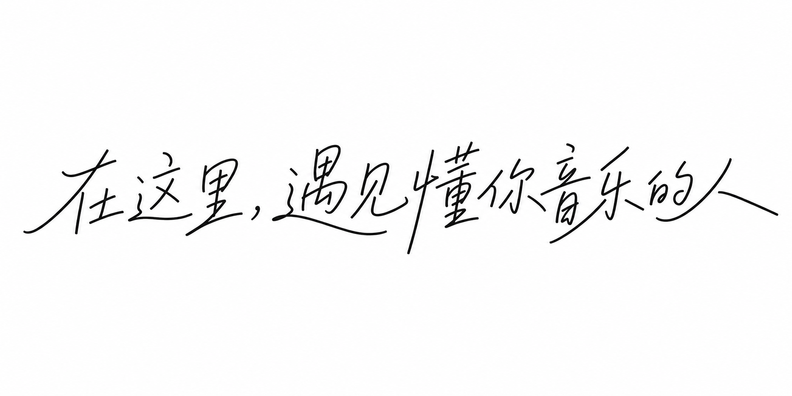
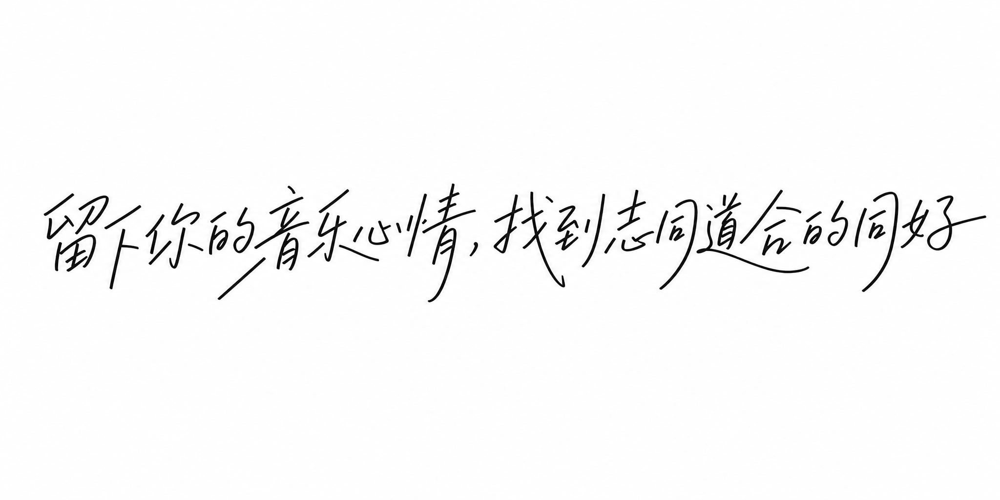

# Chinese Handwriting Style Font Skill

A Claude Skill for generating Chinese text in a flowing, atmospheric handwritten calligraphy style (氛围感手写体) — with consistent stroke gesture, natural one-pass continuity, rounded (non-sharp) stroke terminals, and a clean pure-white background, guided by six bundled reference images.

[English](#english) | [中文](#中文)

---

## English

### What this is

`SKILL.md` is a [Claude Skill](https://docs.claude.com) that teaches Claude how to generate custom Chinese typography images in a specific flowing handwritten style. It encodes:

- A **multi-reference style synthesis framework** (stroke gesture, structural rhythm, material impression, compositional balance)
- A **one-pass continuity principle** so multi-character phrases look hand-written in a single stroke, not assembled character-by-character
- Hard constraints on **pure white (#FFFFFF) backgrounds** and **rounded, non-sharp stroke terminals**
- A weighting system between two "primary" anchor references and four supporting references, so style stays stable across repeated generations

### Repository structure

```
.
├── SKILL.md              # the skill definition
├── README.md              # this file
├── LICENSE
└── assets/
    ├── reference-01-primary.png   # anchor reference (highest weight)
    ├── reference-02-primary.png   # anchor reference (highest weight)
    ├── reference-03.png           # supporting reference
    ├── reference-04.png           # supporting reference
    ├── reference-05.png           # supporting reference
    └── reference-06.png           # supporting reference
```

### Usage

1. Install/upload `SKILL.md` (and the `assets/` folder alongside it) wherever your Claude setup loads skills from.
2. Ask Claude to generate atmospheric Chinese handwritten text, e.g. "帮我生成一句氛围感手写体文案：与你同行". Claude will read `SKILL.md`, attach the bundled reference images, and follow the workflow/constraints defined there.
3. If you want to swap in your own reference images, replace the files in `assets/` and update the file list at the bottom of `SKILL.md` (Bundled Resources section) accordingly.

### Reference previews

| Primary | Primary |
|---|---|
|  |  |

| Supporting | Supporting | Supporting | Supporting |
|---|---|---|---|
|  |  |  |  |

### License

MIT — see [LICENSE](LICENSE). The `SKILL.md` instructions are freely reusable; if you replace the sample images with your own artwork, make sure you have the rights to distribute them.

---

## 中文

### 这是什么

`SKILL.md` 是一个 [Claude Skill](https://docs.claude.com)，用来指导 Claude 生成特定风格的中文氛围感手写字体图片。它包含：

- **多参考图风格融合框架**（笔画手感、结构节奏、材质质感、构图平衡四个维度）
- **一气呵成原则**，让多字词组看起来像一笔写成，而不是逐字拼接
- 硬性约束：**纯白色背景 (#FFFFFF)** 与 **起笔落笔圆润、无尖锐笔锋**
- 主次参考图权重机制：两张"锚点"参考图 + 四张辅助参考图，保证多次生成时风格稳定

### 仓库结构

```
.
├── SKILL.md              # skill 定义文件
├── README.md              # 本文件
├── LICENSE
└── assets/
    ├── reference-01-primary.png   # 锚点参考图（权重最高）
    ├── reference-02-primary.png   # 锚点参考图（权重最高）
    ├── reference-03.png           # 辅助参考图
    ├── reference-04.png           # 辅助参考图
    ├── reference-05.png           # 辅助参考图
    └── reference-06.png           # 辅助参考图
```

### 使用方法

1. 将 `SKILL.md` 及配套的 `assets/` 文件夹一起上传/安装到你使用的 Claude 环境中（无论是 Claude.ai 的 Skill 上传，还是 Claude Code / API）。
2. 直接向 Claude 提出需求即可，例如："帮我生成一句氛围感手写体文案：与你同行"。Claude 会读取 `SKILL.md`，附带参考图，并按照其中定义的流程与约束执行。
3. 如果想换成你自己的参考图，替换 `assets/` 里的文件，并同步更新 `SKILL.md` 末尾 "Bundled Resources" 部分的文件列表说明即可。

### 参考图预览

| 主要参考图 | 主要参考图 |
|---|---|
|  |  |

| 辅助参考图 | 辅助参考图 | 辅助参考图 | 辅助参考图 |
|---|---|---|---|
|  |  |  |  |

### 许可协议

采用 MIT 协议，详见 [LICENSE](LICENSE)。`SKILL.md` 中的指令文本可自由复用；如果你替换成了自己的参考图，请确保你拥有这些图片的分发权利。
